# Disclaimer
These are my personal notes taken from the [Design For Non-Designers](https://open.sap.com/courses/dfnd1-2) course by openSAP.

The lesson was [Goran highlights basic design and layout elements](https://open.sap.com/courses/dfnd1-2/items/3LEDEQqsMiFPsH1wfcnhQZ).

# Grids
- most designs are organized in grids
- predictable
- organisation
- structure
- easier to design
- easier to code

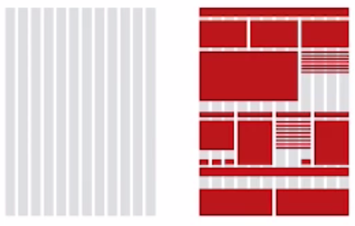

_Elements are layed out onto an invisible grid_

# Internal Structure
- various elements which are equaly spaced

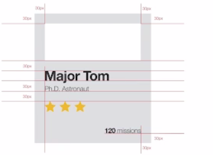

_A card containing multiple equaliy spaced elements (30px)_

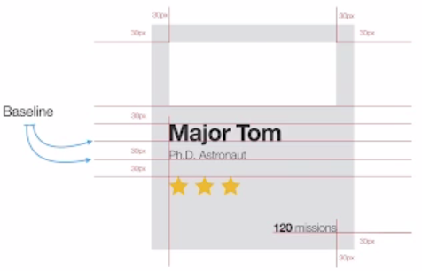

_Fonts are aligned against their base-line_

_Another point of view: little 30x30 px squares hold the layout in place_

# Whitespaces
- helps focus
- tranmits the message of the letter
- removes nerby clutter
- allows the central piece of content to function
- visually separates

_Whitespaces are important_

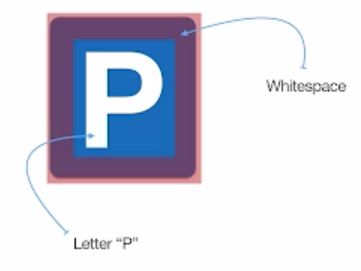

_Whitespace helps trasmitting the letter_

## Whitespace between elements
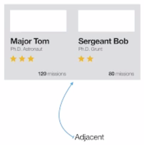

_No separation between the two cards is noticable_

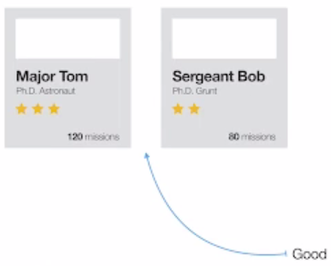

_The cards are now recognizable as two separate things_

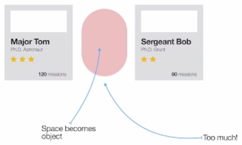

_Too much whitespace becomes a third element_

# Alignment
## Symmetry and organisation
- We perceive symmetry as beauty.
- We recognise neat & organized as trustworthy.
- -> It's just the way our brains are hardwired.

_Symmetry is beautiful - so our brain says_

## Left Alignment
 
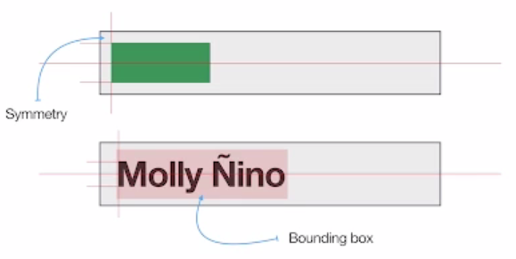

_When aligning left spacing from top, bottom and left are equal_

## Central Alignment
 
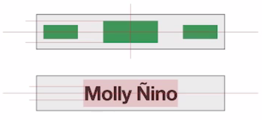

_On central alignment spacing from all sides is equal_

## Right Alignment
 
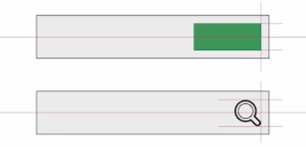

_When aligning right spacing from top, bottom and the right are equal_

## Cross Page Alignment

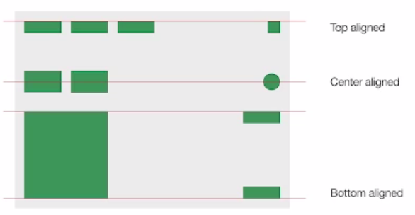

_Alignment rules also hold true on full page layouts_

## Font Base-Line Alignment

_Text is often times aligned to the base-line_

## General Rule
- Alignment is more important than pixel perfect size.

# Interaction
- If something is clickable it should show that it is clickable.
- -> The cursor should change when hovering over a button.
- Also, some visual action should happen on click as well.

- Any clickable element should have a clear design how it looks in these three stages
    - normal
    - hover
    - click

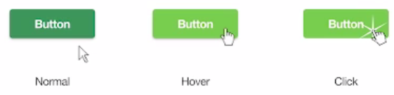

_The three different stages of an element should be easy to distinguish._

# Transitions
- If an element appears on screen it should transition and not appear instantaneously.
- element appears: fade in
- element disappears: fade out
- but don't get too creative here
- if elements scale, also scale them visually. Don't let them just appear.
- If it moves on screen - move it - don't just hide it here and show it there.

Do not do the unexpected!

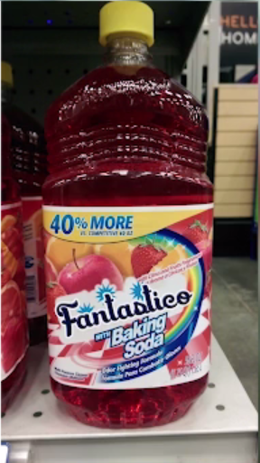

_Unexpected design puts people into hospital - looks like juice but is multi purpose cleaner_

# Screen performance

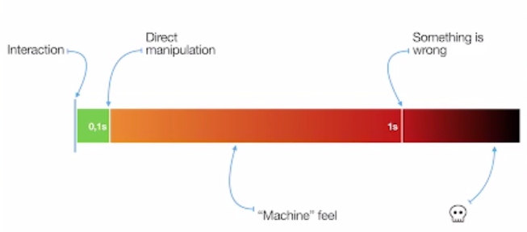

_Less than 100 ms UI response time feels natural_

- __UI response is not application response__
- popping the window is not the same as showing data in that window

## Data Loading Example

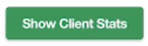

_A click here loads data from the backend_

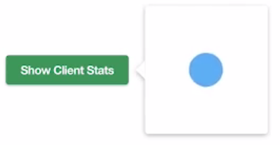

_When clicking a popup with a little animation (pulsating circle) appears_

_When the data has arrived from the backend the animation disappears and the record is shown_

Idea: Use the animation time to load the data.

Goal: The UI should always respond instantaneously keeping the user occupied while data is fetched.

## Browser animations are 60 frames per second
- UI should move at 60 frames per second
- Why:
    - persistance of vision & phi phenomenon
    - browsers are unintelligent

Details:
- 24 fps is minimum frame rate, used in movies (cost efficient)
- 48 fps - for some the images feel to real/ too life like

For convinient animations with 24 fps _motion blur_ is required but this is not supported by the browser or CSS.