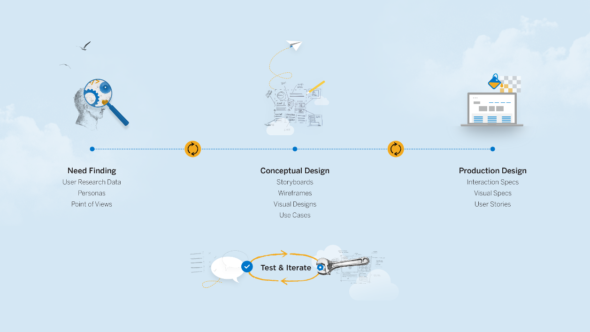

## The Design Process

## Prototyping
- creating an approximation of an design for quick feedback
- enables testing hypothesis
- feedback and iteration
- different audiences
  - collegues
  - clients
  - users
  - yourself
- different prototypes help you figure out different things
- should not be complete
- easy to change
- gets to retire
- _The best way to have a good idea is to have lots of ideas (Linus Pauling)._
- prototypes are questions

## Types of Prototypes
  - storyboarding
  - creating paper prototypes
  - testing paper prototypes
  - creating digital mock-up

## Storyboard Structure
### Starting Picture - Setting
  - who are the people involved?
  - what is the environment?
  - what is the task they are trying to accomplish?

### Middle Frames - Sequence
  - What steps are involved?
  - How to you get from the setting using my design?
  - What task is being illustrated?

### End - Satisfaction
  - What motivates people to use this system?
  - What does it enable people to accomplish?
  - What need does the system fill?

## Paper Prototype
  - user interface idea drawn on a sheet of paper
  - tipps and tricks
    - work quickly and make reusable components (e.g. photo copy reappearing components)
    - keep all material together, widgets can get lost and damaged
    - difficult to simulate? need it on the fly like progress bars or interactive transformation: draw it or describe it
    - background can provide context for the user
    - mix and match - paper and pixels (e.g. sketching over screenshot of old UI), hardware and software
    - add context by including familiar operating system elements (like status bar of smart phone with wifi indicator, time, carrier...)
- different feedback for the different prototypes
  - story board: task/ scenario
  - paper prototype: high level UI
  - mockups: design critiques
  - high fidelity mockups: controlled experiements
 
## Design Review Session
  - discussion let by use cases 
  - design presents the results of their latest iterations with the user
  - participants
    - interaction developer (frontend dev)
    - interaction designer (ux design)
    - project lead to moderate and summarize

## Final Thoughts
- _Design is everyones job._
- _Design is much broader than what the user sees on the screen._

## Snippets
- User Reasearch > Personas  

## Links
- [10 Principles for good design](https://www.vitsoe.com/us/about/good-design/)
- [Splash learning center for design thinking](https://www.experiencesplash.com/splashapp/learning)
- [build.me - Online Prototyping and user research for UI5](http://www.build.me/)
- [How to create a persona](https://vimeo.com/137575149)
