# Heuristic Evaluation 

- inventend by Jacob Nilson around 1990
- use heuristic feedback to critic design
- can be used very early in the project (e.g. on a paper prototype)
- no need to wait for ready build software
- split into three groups
  - understanding
  - action
  - feedback

# How to use it
- group of people
- go through the heuristics
- look fo instances of design that violate the 10 heuristics
- then get together and compare
- decide what is most important to go forward

# Understanding
## Consitency
  - we use our software based on experience

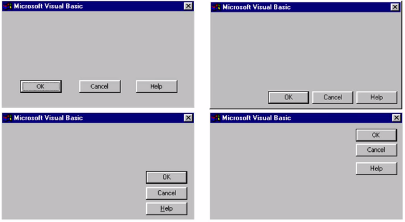

_Bad Example: Four possible layouts of the dialog boxes_

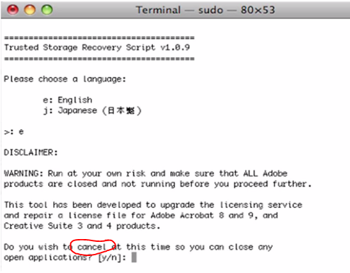

_Bad Example: Pressing "y" is normally used for continuing an operation - not to cancel it_

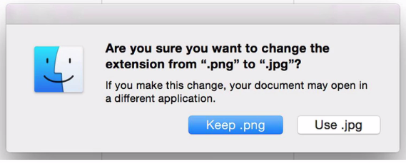

_Good Example: Use the language of the question for the choices_

## Metaphors
  - if designing for a special user group - speak their language

_Use familiar metaphors and language_

## Clean and Functional Desgin
  - form follows function
  - layout should be driven by what people would like to do
  - important information "above the fold" - im oberen Teil der Seite

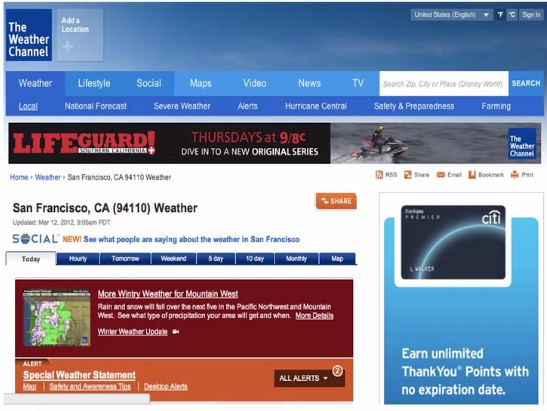

_Bad Example: The important weather information is below the fold_  

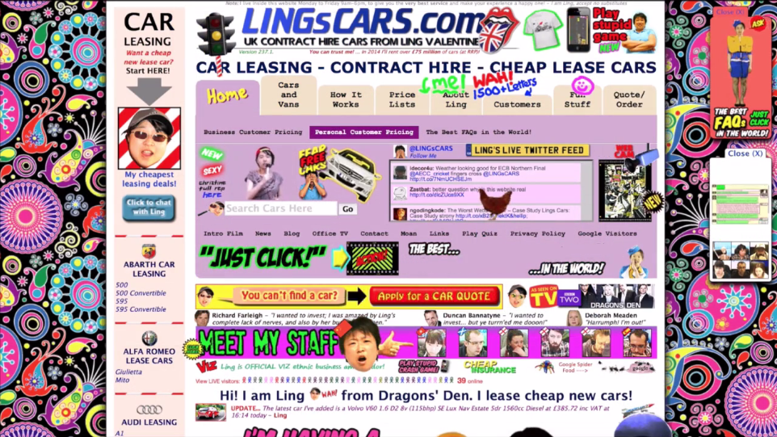

_Bad Example: Just loud_

# Action
## Freedom
  - is the set of things I can possibly do on a site clear?
  - exits from wrong choices
  - Undo/ Redo
  - Not forcing people down fixed paths
  - the more expert somebody is the more it makes sense to "leave the door wide open"
  - the more new somebody is the more tings should be constraint
  - Example: flight booking
    - show also alternative offers like "If you fly one day earlier you could save money"

## Flexibility
  - good interfaces provide flexible and efficient paths for experts
  - good keyboard shortcuts
  - offer the user help: "You might want to do this..."
  - offer good defaults with options
    - provide free text search plus
    - a list of most commonly used destinations

_Good Example: Provide a list of the most common destinations together with free text search_    

  - ambient information
    - better decisions if some context is present

_Good Example: User might decide to do something else on Wedesday if the weather is good_    

_Good Example: Instead of fully unsubscribing to a mailing list offer to reduce the frequency of the mails sent out_

## Recognition over Recall
  - "What you are able to do is clear on the interface shown"
  - e.g. you don't have to remember the meaning of the "red button"

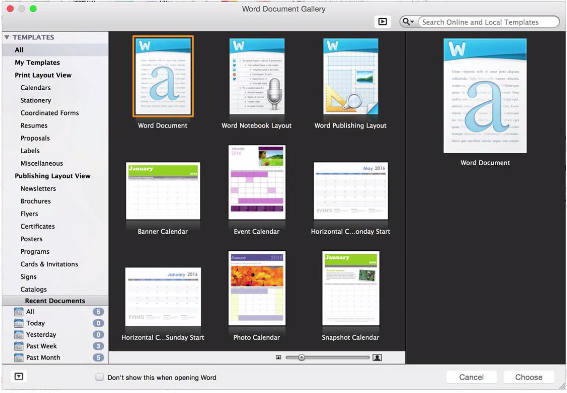

_Good Example: Previews help to recoginize things_

# Feedback
## Show status
- required feedback depends on response time
- under a second: just show the outcome
- about a second:
    - some indicator of status
    - like the spinnging dial in a webbrowsers tab
    - anything that moves on the screen so that users sees that sometinng is happening

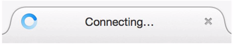

_Good Example: Previews help to recoginize things_

- more than a second:
    - show progress
    - examples
        - circle progress bar
        - linear progress bar
        - count down timer
  

_Good Example: Space available is clearly communicated_
  
- show available options based on what I have done
- Save dialog
    - highlight the default button in a color (blue in the video)
    - pressing enter will execute the default button's action
    - "Save" means on other action than saving
    - "Save..." means there will be a further dialog with more parameters for this action

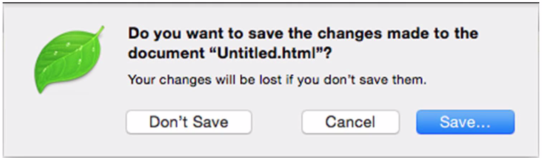

_Good Example: Clear actions and default action is colored_
    
- redundant code
    - traffic lights signal an action by
        1. light color 
        2.  position of the light 

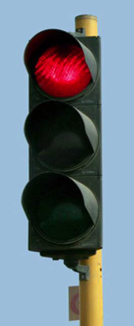

_Good Example: Traffic lights transport information on two channels_
    
## Prevent Errors

_Bad Example: Unclear difference between "Don't Save" and "Cancel"?_

- advantage of a graphical user interace: no syntax errors due to UI structure in contrast to a command line

_Good Example: Find dialog guides through the task whereas "find" on the command line as almost endless options which the user needs to know_

## Support Error Recovery
- when error happen it it important to make the error clear

_Bad Example: Cryptic Error Number_

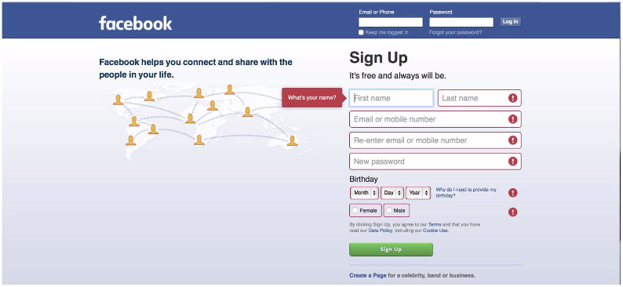

_Good Example: Attempt for an empty signup marks required information by a red box and positions the cursor in the first required field_

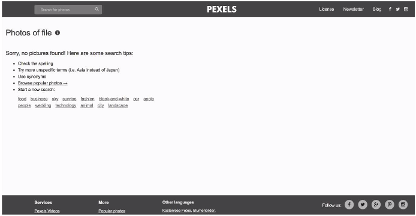

_Good Example: Although nothing was found alternative actions are provided_

- further improvements for the photo search example above:
    - "you searched for 'Scot', here are also the results for 'Scott'
    - widen the range - "you searched in the 'holiday picures', this is what I've found in 'all pictures'

## Provide Help
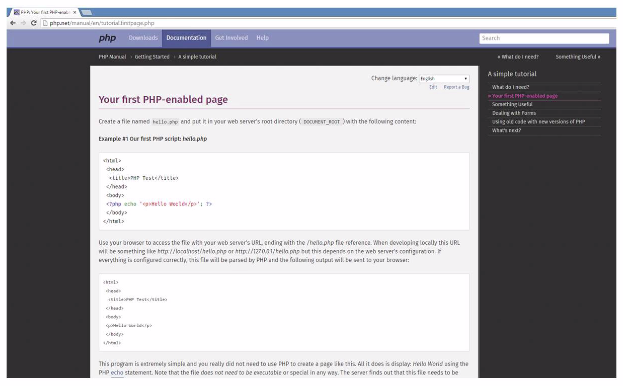

_Good Example: Show examples - particuarly helpful for technical documentation_

